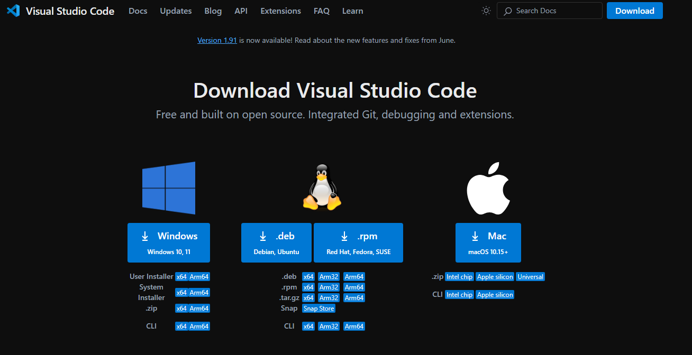
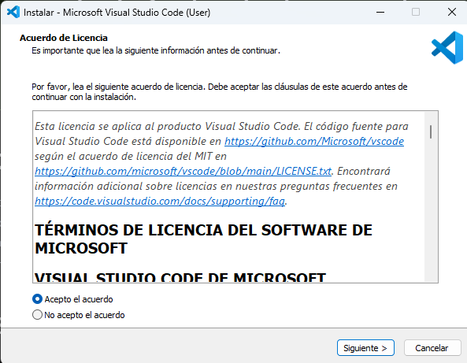
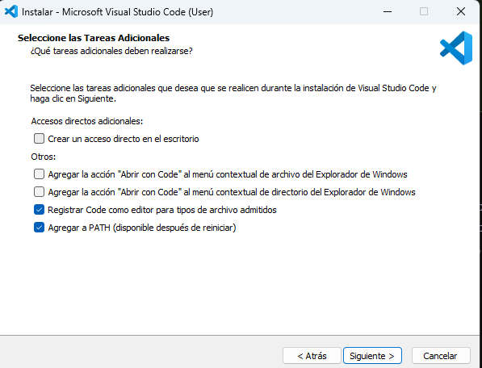
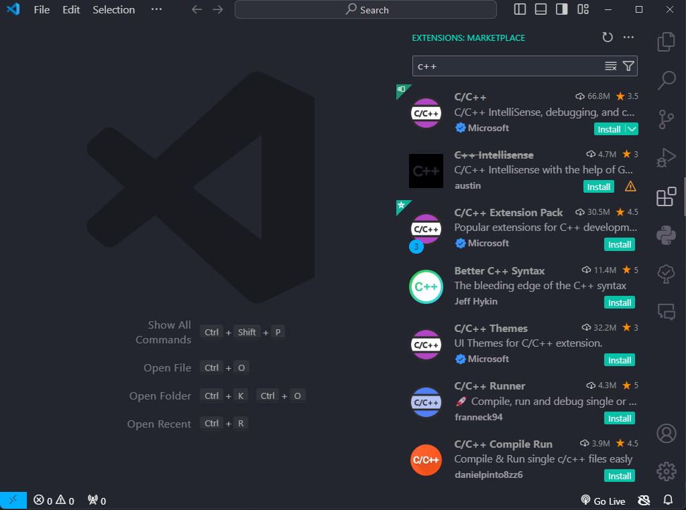
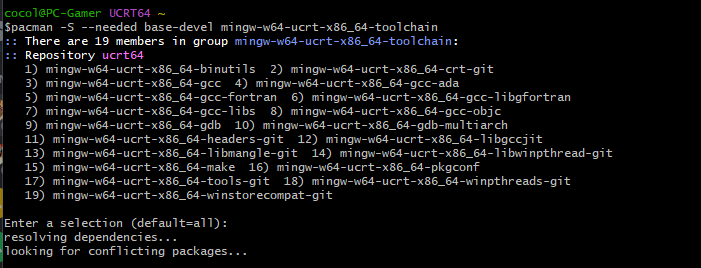
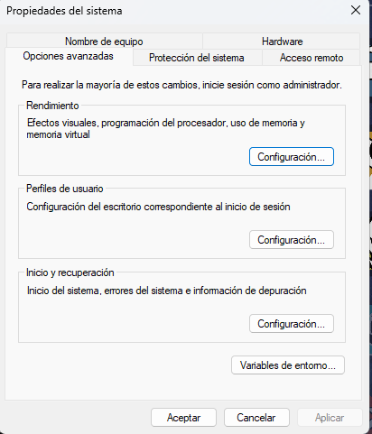
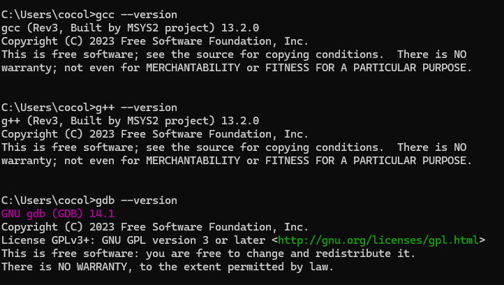

Claro, aquí tienes el texto corregido y mejorado:

---

Para el desarrollo en C++ existen una gran variedad de entornos de desarrollo, cada uno con sus puntos fuertes y débiles. Mi favorito es CLion de IntelliJ, pero ya que es de pago, me he decidido por usar Visual Studio Code, que es muy versátil, permite el desarrollo en múltiples lenguajes de programación y es altamente personalizable por medio de extensiones. A continuación, realizaremos la instalación para Windows; la de Mac es similar, y si usas Linux, ambos sabemos que no necesitas una explicación de cómo instalarlo. De todas formas, adjunto el enlace de la [documentación de Visual Studio Code](https://code.visualstudio.com/docs/cpp/introvideos-cpp).

Toda esta guía está basada en la documentación proporcionada por Visual Studio Code, que también cuenta con el siguiente [vídeo](https://www.youtube.com/watch?v=oC69vlWofJQ) donde se explica todo lo que está abajo.

Para la instalación de nuestro entorno de desarrollo necesitaremos realizar dos pasos:

# Instalación de Visual Studio Code y la extensión de C++

1. Descargamos [Visual Studio Code](https://code.visualstudio.com/download) desde el enlace.\
   
   
   
2. Ejecutamos con permiso de administrador y aceptamos las políticas de uso.\
   
3. En la última pantalla es importante que esté seleccionada la opción de agregar a PATH.\
   
4. Una vez instalado, abrimos la aplicación. Para abrir el menú de extensiones presionamos `Ctrl + Shift + X`, buscamos "C++" e instalamos la primera extensión.\
   

Con esto concluye la instalación del entorno.

# Instalación del compilador

Antes de proceder a la instalación, me gustaría comentar un poco sobre este aspecto. Si tienes algunas nociones básicas sobre informática, sabrás que el ordenador solo entiende 1s y 0s. Nosotros hacemos uso de lo que se conocen como lenguajes de alto nivel que nos permiten usar palabras cercanas al lenguaje natural para poder darle directivas al ordenador.

El compilador es el punto intermedio entre los dos, es el equivalente a un intérprete cuando se habla con alguien de distinto idioma, traduce los lenguajes de alto nivel a bajo nivel.

Para la instalación del compilador vamos a instalar el paquete de herramientas MinGW:

1. Descargamos el instalador MSYS2 con el siguiente [enlace](https://github.com/msys2/msys2-installer/releases/download/2024-01-13/msys2-x86_64-20240113.exe).
2. Abrimos el instalador y seguimos las instrucciones.
3. Establecemos la ruta en la que se instalará, yo recomiendo dejarla por defecto.
4. Una vez se abre la consola, instalamos el paquete con el siguiente comando: `pacman -S --needed base-devel mingw-w64-ucrt-x86_64-toolchain`. Aceptamos todo y se instalará.\

5. El último paso es añadir a las variables de entorno (PATH) la carpeta de MinGW. Para ello:
6. Buscamos en la barra de Windows "variables de entorno" y hacemos clic en "Variables de entorno".\
   
7. Hacemos clic donde pone "Path" y pulsamos "Editar".
8. Pulsamos "Nuevo" y, si has dejado la ruta por defecto, será la siguiente: `C:\msys64\ucrt64\bin`.

Por último, vamos a comprobar la instalación.

Abrimos una consola y escribimos los siguientes comandos: `gcc --version`, `g++ --version`, `gdb --version`, cada uno en una línea independiente. Si todo ha ido bien, saldrá algo como esto:\

---

¡Espero que te sea útil!